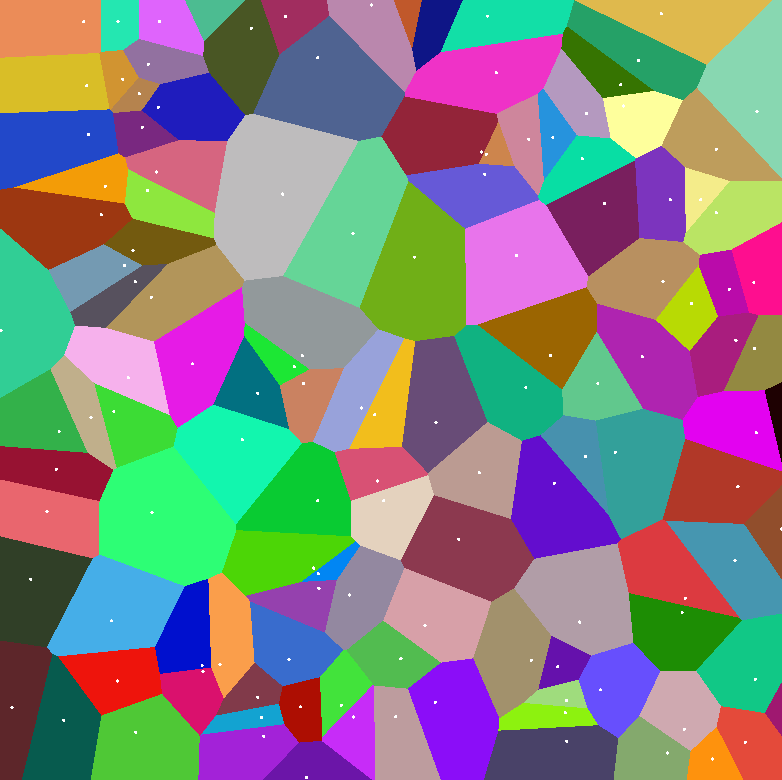
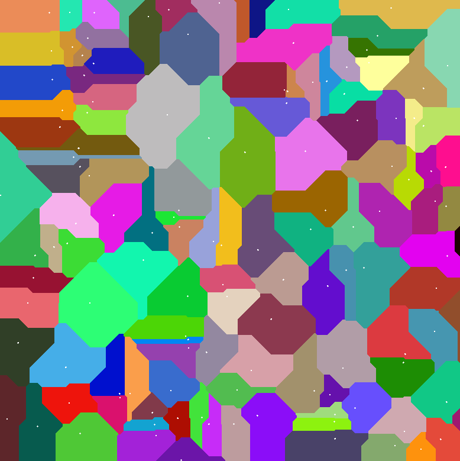
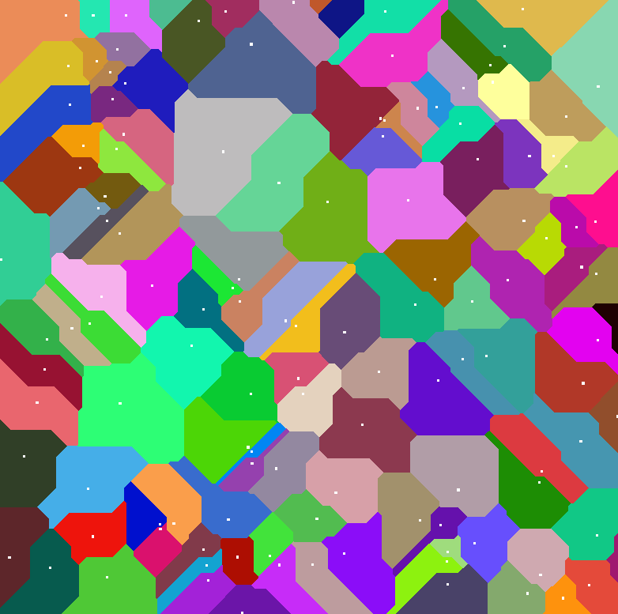

# GlVoronoi

Implementation of some Voronoi algorithms using C++ and OpenGL.

## Pictures

After first version of the code, I was able to draw a Voronoi diagram using 3 different distances :

| Distance | Picture |
| --- | --- |
| Euclidean |  |
| Manhattan |  |
| Chebyshev |  |

## Things i read during the implementation

<https://nullprogram.com/blog/2014/06/01/>  
Nice idea to use the Cones but I'm looking for an exact implementation in 2D only since it will be used to generate maps procedurally.

<https://www.alanzucconi.com/2015/02/24/to-voronoi-and-beyond/>  
Very general and uses Unity. I learned about the Fortune’s algorithm with this one but not suited for a shader implementation.

<https://nickmcd.me/2020/08/01/gpu-accelerated-voronoi/>  
Still haven't read this one in it's entirety, but it goes into a lot of interesting technical details.
